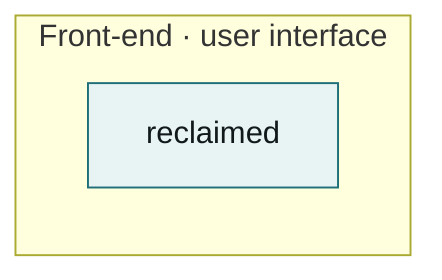
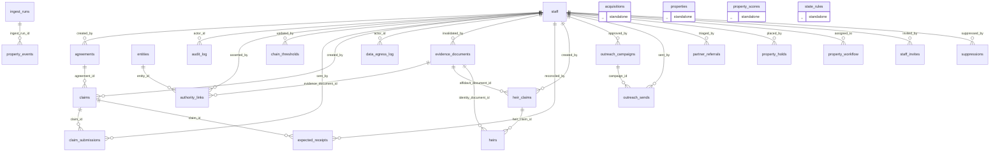

# Architecture — Reclaimed

**Standard.** Components stay minimal and repetitive. Before adding a component, prove that
no existing one can be extended to do the job, and write that proof into section 6. Every
generated block below is derived from the code by `/arch` — never edit one by hand, and
never let one go stale: if the diagram and the code disagree, the code is right and the
doc is broken.

## 1. What this system is

Reclaimed recovers Georgia unclaimed property on behalf of owners, as a registered
claimant's designated representative (CDR), in the cases where proving who may legally sign
is the hard part — deceased owners, dissolved entities, joint owners. Its users are internal
staff; the public site exists to decline business lawfully and send most readers to the free
state portal. **The shaping constraint is O.C.G.A. § 44-12-239.2: twelve acts sanctionable at
$2,000 each.** Every guardrail is therefore enforced in code — database constraint, RLS,
runtime assert, CI gate — rather than by policy. Status 2026-09-21: unregistered; nothing can
transmit; the Supabase project backing it is no longer present in the account.

## 2. Products and features

### 2.1 Acquisition and ingest
Fetch publisher files (`lib/acquire`), sniff/parse/load them (`lib/ingest`, `scripts/ingest.ts`),
diff into the canonical set. **Owns:** `acquisitions`, `ingest_runs`, `properties_staging`,
`properties`, `property_events`. Only feature that writes `properties`.

### 2.2 Scoring and the work queue
Rank workable property by expected value (`lib/scoring`, `scripts/score.ts`); views
`properties_workable` → `properties_priority` → `work_queue`. **Owns:** `property_scores`.
Reads `properties` (2.1) and `state_rules` (2.8).

### 2.3 Staff pipeline — Board, Queue, Workflow, Holdings
`app/(staff)`, `lib/db/{workflow,holdings}.ts`, `lib/pipeline`, `components/board`.
**Owns:** `property_workflow`, `property_holds`. Reads `properties`, `property_scores`, and the
views `acquisition_inventory`, `holdings_composition`.

### 2.4 Authority to sign
Evidence chain proving the signer (`lib/locate`, `lib/db/authority.ts`,
`components/AuthorityChain.tsx`). **Owns:** `authority_links`, `evidence_documents`,
`entities`, `chain_thresholds`, `heir_claims`, `heirs`. Append-only by rule.

### 2.5 Agreements, claims, payment
UP-CDR forms (`lib/forms`), submission (`lib/claims`). **Owns:** `agreements`, `claims`,
`claim_submissions`, `expected_receipts`. Transmission blocked until registered.

### 2.6 Outreach
Legended letters and sends (`lib/outreach`, `lib/compliance/legend.ts`). **Owns:**
`outreach_campaigns`, `outreach_sends`, `suppressions`. Blocked until registered.

### 2.7 Public surface, partner API, MCP
`app/(public)`, `lib/public`, `app/api/v1`, `mcp/server.ts`. **Owns:** `partner_referrals`
(inbound only). Reads no property table — enforced by `verify:no-public-data`.

### 2.8 Rules, identity, audit
`lib/compliance`, `lib/db/auth.ts`. **Owns:** `state_rules`, `staff`, `staff_invites`,
`audit_log`, `data_egress_log`.

## 3. Component inventory

<!-- arch:begin:counts -->
| Measure | Count |
|---|---|
| Components | 1 |
| Tables | 26 |
| Foreign keys | 34 |
| Tables with no FK either way | 4 |
| Distinct error types | 18 |
| Symbol names defined 3+ times | 3 |
| ARDs on record | 0 (0 contributing to the diagram) |
| Components declared by ARDs | 0 |
| Features declared by ARDs | 0 |
<!-- arch:end:counts -->

The generator sees one workspace package. The logical components:

| Component | Layer | Owns | Pattern (§6) |
|---|---|---|---|
| `lib/acquire` | Middleware | acquisitions | Permission-typed source |
| `lib/ingest` + `scripts/ingest.ts` | Middleware | ingest_runs, properties_staging, properties, property_events | Workstation CLI |
| `lib/scoring` + `scripts/score.ts` | Middleware | property_scores | Workstation CLI |
| `lib/compliance` | Middleware | state_rules | Derived state, no override |
| `lib/db/*` | Middleware | (read models) | Staff-gated read |
| `lib/locate` | Middleware | authority_links, evidence_documents, entities, heir_* | Append-only record |
| `lib/forms`, `lib/claims`, `lib/outreach` | Middleware | agreements, claims, outreach_* | Registration-gated action |
| `lib/public` | Middleware | — (in-repo data only) | Sourced static data |
| `app/api/v1`, `mcp/server.ts` | Middleware | partner_referrals | Inbound-only surface |
| `app/(staff)`, `components/board` | Front-end | — | Staff-gated read |
| `app/(public)`, `components/public` | Front-end | — | Sourced static data |
| `db/migrations` | Back-end | all tables | — |
| `scripts/verify-*.ts`, `.github/workflows` | Infrastructure | — | Negative-probed gate |

## 4. System architecture

Components grouped by layer, edges are dependencies.

<!-- arch:begin:components -->

<!-- arch:end:components -->

## 5. Backend ERD

Every table and every foreign key. Tables shown standalone have no foreign key in either
direction — see the sprawl watch.

<!-- arch:begin:erd -->

<!-- arch:end:erd -->

## 6. Design patterns we repeat

| Pattern | Canonical implementation | Use it when |
|---|---|---|
| Derived state, no override | `lib/compliance/offerState.ts` | a capability depends on registration — never add a flag |
| Registration-gated action | `assertMayTransmit()` in `lib/compliance/operatingMode.ts` | anything that sends, files, or signs |
| Staff-gated read | `getSessionState()` + RLS `is_active_staff()`; views `security_invoker` | any read of property data |
| Append-only record | `DO INSTEAD NOTHING` rules, e.g. `authority_links` | evidence, audit, submissions |
| Workstation CLI | `scripts/ingest.ts` + `scripts/lib/args.ts` | bulk data or credential-holding work |
| Permission-typed source | `lib/acquire/sources.ts` discriminated union | any external fetch |
| Sourced static data | `lib/public/marketStats.ts`, `comparison.ts` | any fact published on the public site |
| Inbound-only surface | `app/api/v1/intake`, `mcp/server.ts` | anything reachable without a session |
| Negative-probed gate | `scripts/verify-*.ts` | a rule a reviewer could miss |

**Same problem, solved twice — findings:**

- **Stat tiles ×3.** `components/public/StatGrid.tsx`, a local `Stat` in
  `app/(staff)/holdings/page.tsx`, another in `app/(staff)/property/[id]/page.tsx`. StatGrid wins.
- **Supabase clients ×2.** `lib/db/supabase.ts` (session) and a direct `createClient` in
  `app/api/v1/intake/route.ts` (anon). Keep both behaviours; move the anon one into `lib/db`.
- **Styling ×2.** Public pages use tokens (`.fact-table`, `var(--…)`); staff pages hard-code hex.
  Tokens win.
- **Stage order ×3.** `db/migrations/0020_workflow.sql`, `lib/db/workflow.ts`,
  `lib/pipeline/phases.ts`. The migration's enum wins; generate the other two from it.

## 7. Sprawl watch

Generated. Each entry is a consolidation candidate — the goal is fewer component kinds,
repeated, not more kinds.

<!-- arch:begin:sprawl -->
Generated. Every item here is a candidate for consolidation — the goal is **fewer component kinds, repeated**, not more kinds.

| Measure | Count |
|---|---|
| Tables | 26 |
| Foreign keys | 34 |
| Tables with no FK in or out | 4 |
| Components (workspace members) | 1 |
| Components nothing depends on | 0 |
| Distinct error types | 18 |
| Client/Service/Manager/Handler/Provider types | 1 |
| Symbol names defined 3+ times | 3 |

## Tables with no foreign key in either direction

Either genuinely standalone, or the relationship exists in code but not in the schema — which is exactly how data starts sprawling.

- `acquisitions` — db/migrations/0023_acquisition.sql:31
- `properties` — db/migrations/0003_properties.sql:20
- `property_scores` — db/migrations/0007_scoring.sql:9
- `state_rules` — db/migrations/0002_state_rules.sql:16

## Symbol names defined three or more times

Repetition of a *pattern* is good. Repetition of a *name* usually means the same idea was implemented several times.

| Name | Definitions | Where |
|---|---|---|
| `metadata` | 26 | app, app/(auth), app/(public) |
| `dynamic` | 12 | app/(auth)/auth/finish, app/(auth)/signin, app/(staff)/dashboard |
| `GET` | 6 | app/api/openapi.json, app/api/property/[id]/letter, app/api/v1/status |

## Error types

18 distinct error types. If they do not share one conversion path, every call site invents its own handling.

- `AcquisitionRefusedError`
- `AgreementError`
- `ArgumentError`
- `AuthorityChainError`
- `BlockedHostError`
- `BrandGuardError`
- `ChallengeDetectedError`
- `ChannelNotPermittedError`
- `ForbiddenSchemaTypeError`
- `LegendUnverifiedError`
- `LiveActionBlockedError`
- `NotRegisteredError`
- `OfferStateViolationError`
- `PayeeAddressError`
- `SendBlockedError`
- `SubmissionBlockedError`
- `UnknownStateError`
- `UnverifiedStateRulesError`
<!-- arch:end:sprawl -->

## 8. Change protocol

Before a change lands:

1. Does it fit an existing component? If not, say in section 3 why a new one is required.
2. Does it fit an existing pattern from section 6? If not, add the pattern there first.
3. Does it add a table? Then it adds a foreign key, or it explains in section 7 why it is
   genuinely standalone.
4. Re-run `/arch`. If a generated block changed, the change is architectural — say so in
   the PR body, under the layer it belongs to.

## 9. Sprawl findings (2026-09-21)

**Orphan tables.**
- `properties` — not standalone. Eight tables carry `property_id` with **no FK**:
  `property_workflow`, `property_scores`, `property_events`, `property_holds`,
  `authority_links`, `heir_claims`, `outreach_sends`, `properties_staging`. All but staging
  (which holds rows not yet loaded) should get `references properties on delete restrict`.
  Safe: ingest retires rows via `retired_at`, never deletes.
- `property_scores` — same finding; the FK above resolves it.
- `acquisitions` — `ingest_runs.acquisition_id` references it in code only. Add the FK.
- `state_rules` — genuinely standalone reference data, keyed by state code.

**Duplicated names.** `metadata` ×26 is the `PUBLIC_PAGES.find(...)!` idiom copy-pasted into
every page — one `buildMetadata(href)` in `lib/public` replaces it. `dynamic` ×12 and `GET` ×6
are Next.js conventions, not duplication.

**Error types.** 18, every one extending `Error` directly, no shared conversion path. Thirteen
mean "a compliance guard refused" (`NotRegisteredError`, `SendBlockedError`,
`LiveActionBlockedError`, …) and each call site maps it to a response on its own. One
`ComplianceRefusal` base carrying `code` and `citation` gives the API one mapping.

**ADR location.** 12 ADRs live in `docs/DECISIONS.md`; `/arch` reads ARDs with ` ```arch `
blocks and finds 0, so §2's generated feature map is empty.

| Finding | Consolidate into | Effort |
|---|---|---|
| No FK to `properties` from 7 tables; `acquisitions` unlinked | one migration adding FKs, tested against a live DB | M |
| Stage order ×3 | generate from `0020_workflow.sql` enum | M |
| 13 compliance errors, no base | `ComplianceRefusal` in `lib/compliance` | S |
| `metadata` idiom ×26 | `buildMetadata(href)` in `lib/public` | S |
| Stat tiles ×3 | `components/public/StatGrid.tsx` | S |
| Staff pages hard-code hex | tokens from `app/globals.css` | M |
| Anon Supabase client outside `lib/db` | `lib/db/supabase.ts` factory | S |
| ADRs invisible to `/arch` | add ` ```arch ` blocks or move to ARD files | S |

---

_Generated by `/arch` from the code. Do not edit the blocks below by hand._

---

_Generated by `/arch` from the code. Do not edit the blocks below by hand._

## Products and features

<!-- arch:begin:features -->
```mermaid
flowchart LR
  %% no feature declared by any ARD yet — add an ```arch block to one
```
<!-- arch:end:features -->

