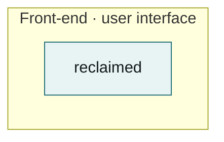
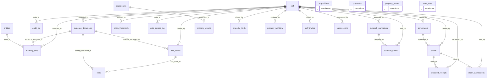

# Architecture — Reclaimed

**Standard.** Components stay minimal and repetitive. Before adding a component, prove that
no existing one can be extended to do the job, and write that proof into section 6. Every
generated block below is derived from the code by `/arch` — never edit one by hand, and
never let one go stale: if the diagram and the code disagree, the code is right and the
doc is broken.

## 1. What this system is

_One paragraph. What it does, for whom, and the single constraint that shapes it._

## 2. Products and features

_The systems architecture in words. One subsection per product or feature, each naming the
components it uses and the tables it owns. A feature that owns no table reads someone
else's data — say whose, so ownership never becomes ambiguous._

## 3. Component inventory

<!-- arch:begin:counts -->
| Measure | Count |
|---|---|
| Components | 1 |
| Tables | 25 |
| Foreign keys | 33 |
| Tables with no FK either way | 4 |
| Distinct error types | 18 |
| Symbol names defined 3+ times | 3 |
| ARDs on record | 0 (0 contributing to the diagram) |
| Components declared by ARDs | 0 |
| Features declared by ARDs | 0 |
<!-- arch:end:counts -->

_For each component, one line: what it owns, which layer it sits in, and which of the
repeated patterns in section 6 it implements. A component that implements no listed pattern
is either a new pattern (add it to section 6) or sprawl (fold it into a neighbour)._

## 4. System architecture

Components grouped by layer, edges are dependencies.

<!-- arch:begin:components -->

<!-- arch:end:components -->

## 5. Backend ERD

Every table and every foreign key. Tables shown standalone have no foreign key in either
direction — see the sprawl watch.

<!-- arch:begin:erd -->

<!-- arch:end:erd -->

## 6. Design patterns we repeat

_The small set of shapes this system reuses everywhere. Name each one, point at the
canonical implementation, and say when to reach for it. Anything not on this list is a new
pattern and needs justifying here before it ships._

| Pattern | Canonical implementation | Use it when |
|---|---|---|
| _e.g. repository_ | `path/to/file.rs` | _reading or writing a tenant-scoped table_ |

## 7. Sprawl watch

Generated. Each entry is a consolidation candidate — the goal is fewer component kinds,
repeated, not more kinds.

<!-- arch:begin:sprawl -->
Generated. Every item here is a candidate for consolidation — the goal is **fewer component kinds, repeated**, not more kinds.

| Measure | Count |
|---|---|
| Tables | 25 |
| Foreign keys | 33 |
| Tables with no FK in or out | 4 |
| Components (workspace members) | 1 |
| Components nothing depends on | 0 |
| Distinct error types | 18 |
| Client/Service/Manager/Handler/Provider types | 1 |
| Symbol names defined 3+ times | 3 |

## Tables with no foreign key in either direction

Either genuinely standalone, or the relationship exists in code but not in the schema — which is exactly how data starts sprawling.

- `acquisitions` — db/migrations/0023_acquisition.sql:31
- `properties` — db/migrations/0003_properties.sql:20
- `property_scores` — db/migrations/0007_scoring.sql:9
- `state_rules` — db/migrations/0002_state_rules.sql:16

## Symbol names defined three or more times

Repetition of a *pattern* is good. Repetition of a *name* usually means the same idea was implemented several times.

| Name | Definitions | Where |
|---|---|---|
| `metadata` | 15 | app, app/(auth), app/(public) |
| `dynamic` | 9 | app/(auth)/auth/finish, app/(auth)/signin, app/(staff)/dashboard |
| `GET` | 4 | app/api/property/[id]/letter, app/auth/callback, app/auth/confirm |

## Error types

18 distinct error types. If they do not share one conversion path, every call site invents its own handling.

- `AcquisitionRefusedError`
- `AgreementError`
- `ArgumentError`
- `AuthorityChainError`
- `BlockedHostError`
- `BrandGuardError`
- `ChallengeDetectedError`
- `ChannelNotPermittedError`
- `ForbiddenSchemaTypeError`
- `LegendUnverifiedError`
- `LiveActionBlockedError`
- `NotRegisteredError`
- `OfferStateViolationError`
- `PayeeAddressError`
- `SendBlockedError`
- `SubmissionBlockedError`
- `UnknownStateError`
- `UnverifiedStateRulesError`
<!-- arch:end:sprawl -->

## 8. Change protocol

Before a change lands:

1. Does it fit an existing component? If not, say in section 3 why a new one is required.
2. Does it fit an existing pattern from section 6? If not, add the pattern there first.
3. Does it add a table? Then it adds a foreign key, or it explains in section 7 why it is
   genuinely standalone.
4. Re-run `/arch`. If a generated block changed, the change is architectural — say so in
   the PR body, under the layer it belongs to.

---

_Generated by `/arch` from the code. Do not edit the blocks below by hand._

---

_Generated by `/arch` from the code. Do not edit the blocks below by hand._

## Products and features

<!-- arch:begin:features -->
```mermaid
flowchart LR
  %% no feature declared by any ARD yet — add an ```arch block to one
```
<!-- arch:end:features -->

